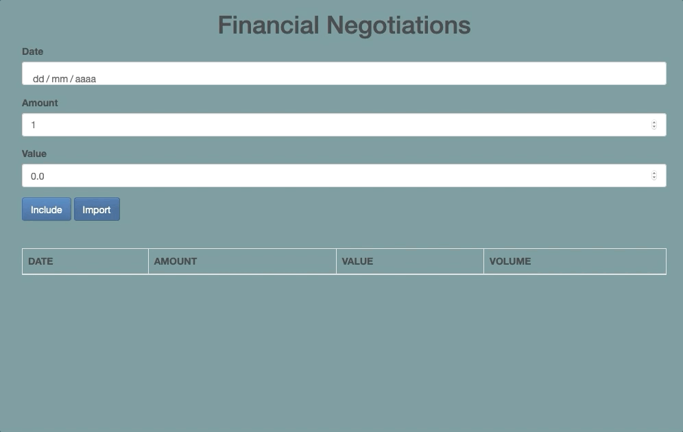

<meta charset="utf-8">
<h1 align="center">Alurabank - Financial Negotiations 🏦</h1>

<h2 align="center">

<h2>

 
<h2> ⚙️ Stack </h2>

  - [TypeScript](https://www.typescriptlang.org/sys)
  - [Bootstrap](https://getbootstrap.com/jquer)
  - [JQuery](https://jquery.com/)
  - [SystemJS](https://www.npmjs.com/package/systemjs) 

 
<h2> 🎯 Purpose </h2>

- Understand which are the benefits of types and type inference in TypeScript by creating an application that stores financial negotiations 
- To be introduced to the main concepts behind this superset by the manipulation of its tools: 
  - Classes, private syntax and readonly properties 
  - nodejs and TS compilation
  - Implicit type any, convertion through casting and explicit types
  - Heritage, abstract classes, interfaces, enums and polymorphism
  - TypeScript Definitions
  - Module system ES2016
  - namespaces x loaders
  - strictNullCheck
  - Decorators (of methods and properties)
  - Lazy loading
  - API calls and debounce pattern using decorators
  - ES2017: Async/await

 
  
<h2> 🛠️ Implementations </h2>

- Import negotiations from a server ✅
  

--- 
 
 
 

- Adding new negotiations ✅

--- 
 
 
 

- Prevent the addition of negotiations on non business days ✅
  

 

--- 
 
   
 

 
<h2> 🌱 🌳 Contributions </h2>

    1. Make a Fork of this project
    2. Create a branch with the new feature/fix:
       $ git checkout -b your-feature
    3. Create a commit: 
       $ git commit -m 'feat/fix: your feature'
    4. Make the push to the branch
       $ git push origin your-feature
    5. Open a Pull Request

  

This applicaction was developed during the <a target="_blank" href="https://www.alura.com.br/curso-online-typescript-parte1
">TypeScript parte 1</a> and <a target="_blank" href="https://www.alura.com.br/curso-online-typescript-parte2
">TypeScript parte 2</a>  courses from Alura 👩‍💻 

